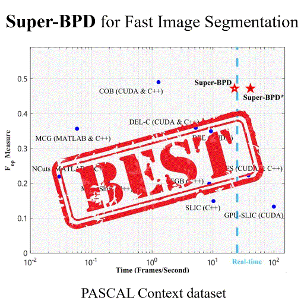

# Super-BPD for Fast Image Segmentation (CVPR 2020)

## Introduction

We propose direction-based super-BPD, an alternative to superpixel, for fast generic image segmentation, achieving state-of-the-art real-time result.



## Citation

Please cite the related works in your publications if it helps your research:

```

@InProceedings{Wan_2020_CVPR,
author = {Wan, Jianqiang and Liu, Yang and Wei, Donglai and Bai, Xiang and Xu, Yongchao},
title = {Super-BPD: Super Boundary-to-Pixel Direction for Fast Image Segmentation},
booktitle = {The IEEE/CVF Conference on Computer Vision and Pattern Recognition (CVPR)},
month = {June},
year = {2020}
}

```

## Prerequisite
* pytorch >= 1.3.0
* g++ 7

## Dataset
* Download the [BSDS500  & PascalContext Dataset](https://drive.google.com/file/d/1OdfkelacNMmcp3STVyGzPql-Z21Efxqk/view?usp=sharing), and unzip it into the `Super-BPD/data` folder.

## Testing
* Compile cuda code for post-process.

```
cd post_process
python setup.py install
```

* Download the pre-trained [PascalContext model](https://drive.google.com/file/d/1d-bkw7CURrmVwjpMvVb_QbSlIwhj-glS/view?usp=sharing) and put it in the `saved` folder.

* Test the model and results will be saved in the `test_pred_flux/PascalContext` folder.

* [SEISM](https://github.com/jponttuset/seism) is used for evaluation of image segmentation.

## Training
* Download [VGG-16 pretrained model](https://drive.google.com/file/d/13G5HaMQcZ-GsXL2nEaoC_2s3Sewmuag-/view?usp=sharing).

```
python train.py --dataset PascalContext
```

